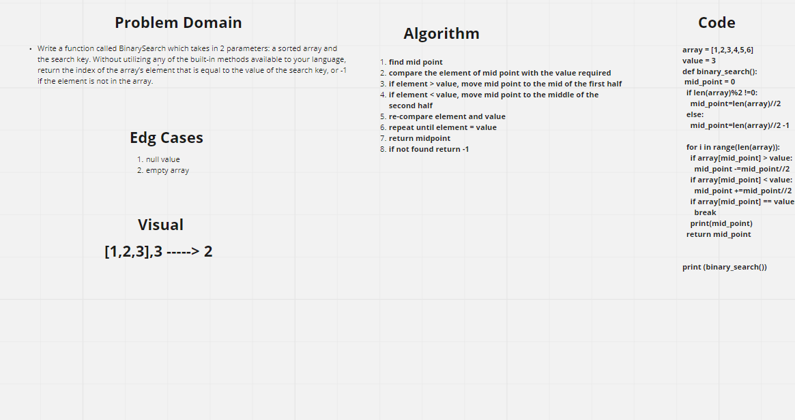

# Binary Search of Sorted Array
Find the index of a given element inside an array or return -1 when not found
## Whiteboard Process
[link to whiteboard](https://webwhiteboard.com/board/nf7Wpb67dtroiGLsYj4c78Ma3EKouSNv/)

## Approach & Efficiency
<!-- What approach did you take? Discuss Why. What is the Big O space/time for this approach? -->