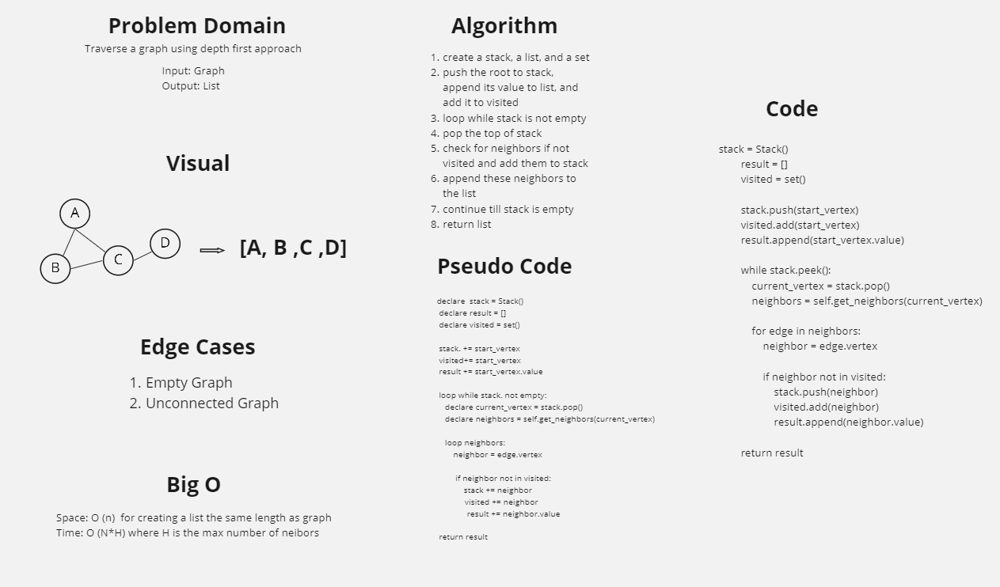

# Depth First Traversal
Traverse a graph from leaves to roots

## Challenge
Traverse a graph using depth first approach

## Approach & Efficiency
Space: O (n)  for creating a list the same length as graph
Time: O (N*H) where H is the max number of neibors

## Solution

