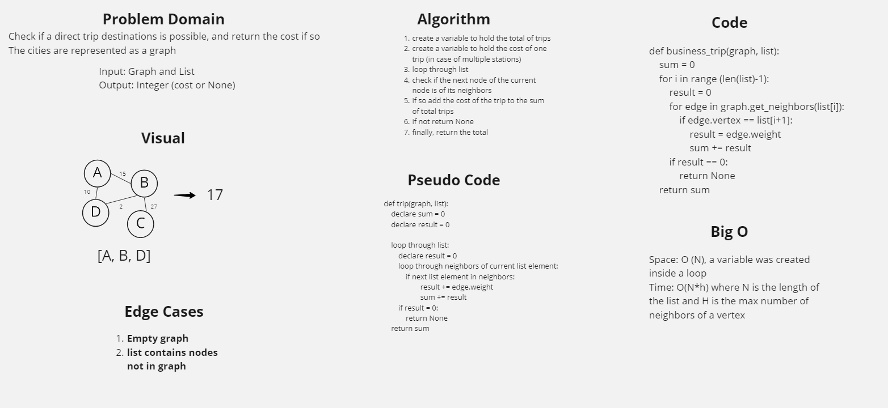

# Challenge Summary
Check if a direct trip destinations is possible, and return the cost if so
The cities are represented as a graph

## Whiteboard Process

## Approach & Efficiency
Space: O (N), a variable was created inside a loop
Time: O(N*h) where N is the length of the list and H is the max number of neighbors of a vertex

## Solution
The function takes a graph and a list as arguments and returns the cost as integer
