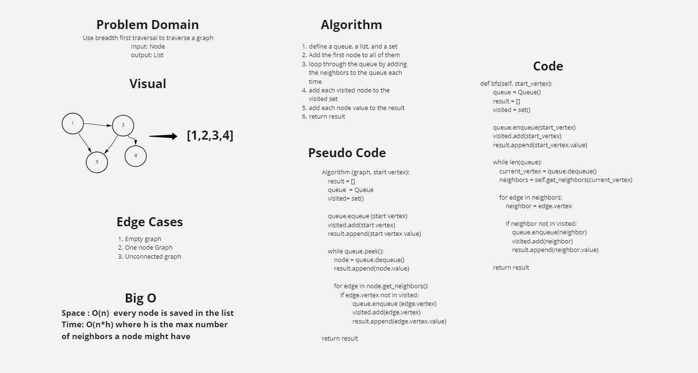

## Challenge
Use breadth first traversal to traverse a graph

## Approach & Efficiency
Space : O(n)  every node is saved in the list

Time: O(n*h) where h is the max number of neighbors a node might have

## Solution
A function takes a graph and a starter vertex as arguments and returns a list of node values

## Requirements

A predefined class for creating a grapgh and methods to add vertexes and edges; and to get neighbors
