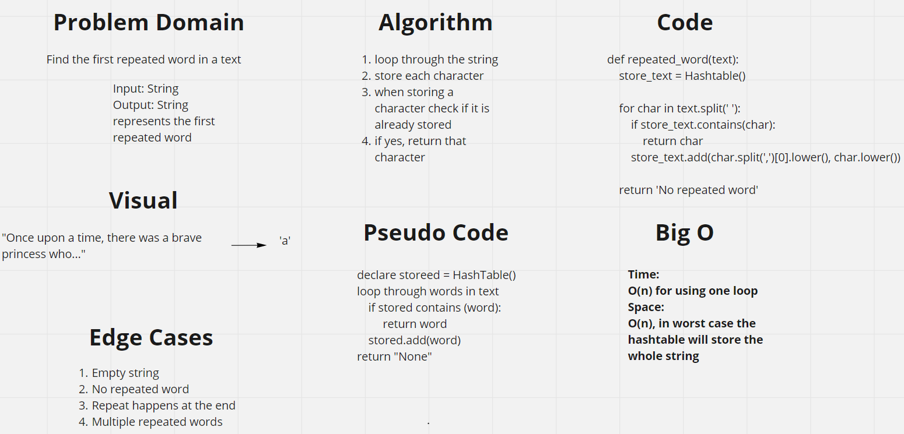

# Hashtables
A data structure that makes it easier to search for a value inside a list, each value will have a hash generated by a hash function and stored in an index equal to this hash, if we have a key, we will use the same algorithm to produce its hash and retrieve it from the list

## Challenge
Create a class for hashtable, include methods to hash a key, get a key, and check if the key is stored in the hashtable

## Approach & Efficiency
In case of no collision big o of time and space will be o(1), with collision, the big o will be o(n) where n here represents the number of values having the same hash and not the list length.

## Solution
The hash table has a method to add which takes a key and value as strings and adds them to the hash table, also it contains a method called contains which takes a key and return True ifit is found in the table or Flase if not, finally, the get method takes a key and returns its value

# Repeated Word
Find the first repeated word in a text

## Whiteboard Process

## Approach & Efficiency
Time:
O(n) for using one loop, it will loop over the whole text in worst case
Space:
O(n), in worst case the hashtable will store the whole string

## Solution
The repeated_word function takes a `string` as an argument an returns a `string` representing the first repeated word, or returns a message (No repeated word) if no repeated word found