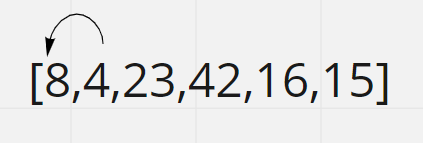
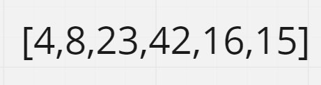
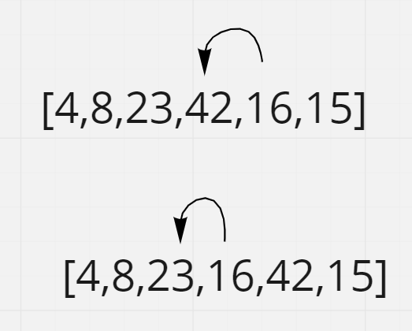
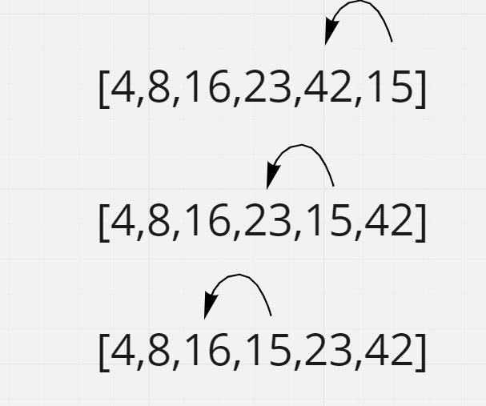

# Tracing Insertion Sort Code
This article traces a psuedo code for insertion sort, here an array will be sorted in place by comparing each item to the following items in the array, each time this item will be replaced with the smallest value of the next items.

## Pseudo Code
    InsertionSort(int[] arr)

    FOR i = 1 to arr.length

      int j <-- i - 1
      int temp <-- arr[i]

      WHILE j >= 0 AND temp < arr[j]
        arr[j + 1] <-- arr[j]
        j <-- j - 1

      arr[j + 1] <-- temp

## Tracing
Input: [8,4,23,42,16,15]

- **Iteration 1:**

    i = 1, j = 0, temp = 4:

    Array after 1'st iteration: [4,8,23,42,16,15]

    

- **Iteration 2:**

    i = 2, j = 1, temp = 23:

    Array after 2'nd iteration: [4,8,23,42,16,15]

    

- **Iteration 3:**

    i = 3, j = 2, temp = 42:

    Array after 3'rd iteration: [4,8,23,42,16,15]

    

- **Iteration 4:**

    i = 4, j = 3, temp = 16:

        [4,8,23,16,42,15]

    i = 4, j = 2, temp = 16: 
    
        [4,8,16,23,42,15]

    Array after 4'th iteration: [4,8,16,23,42,15]

    

- **Iteration 5:**

    i = 5, j = 4, temp = 15:

        [4,8,16,23,15,42]

    i = 5, j = 3, temp = 15:

        [4,8,16,15,23,42]

    i = 5, j = 2, temp = 15:

        [4,8,15,16,23,42]

    Array after 5'th iteration: [4,8,15,16,23,42]

    

