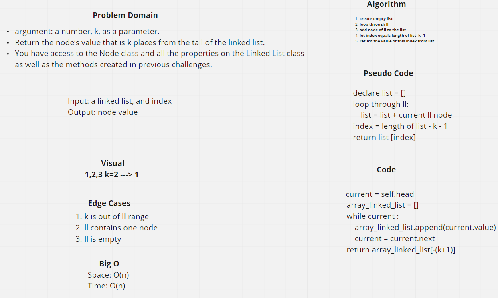
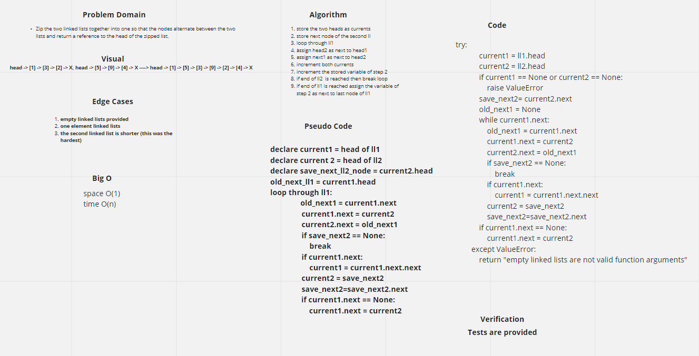

# Singly Linked List
A singly linked list as a set of elements called nodes in which each element refrence the next element, the first element is called head, and the last element is always None.

In case of having an empty linked list it will contain one element; None.

## Challenge
Create clsses to instntiate nodes and linked lists.

## Approach & Efficiency
For adding to a linked list, loops were used (without nesting), this results in an O(n) Big O.

## API
No APIs till now

# Challenge Summary 06
Insert before and after a node in a linked list

## Whiteboard Process
N/A

## Approach & Efficiency
Loops without nesting were used, resulted in a O(n) Big O

## Solution
Use Pytest on your CLI to see results

# Challenge Summary 07
Find the value for element according to its index from the end

## Whiteboard Process
[white board link](https://webwhiteboard.com/board/neNFHaVZdrACDsJiemaCqMtlFOxmzi3C/)

## Approach & Efficiency
Loop was used without nesting ->  o(n) Big O

## Solution
Tests are embded within repo

# Challenge Summary 08
Zip the two linked lists together into one so that the nodes alternate between the two lists and return a reference to the head of the zipped list.

## Whiteboard Process
[white board link](https://webwhiteboard.com/board/XhQ7PZTM2F3EZmgE1Q63GjOZ09QpDPVp/)

## Approach & Efficiency
Loop was used without nesting ->  o(n) Big O
space --> O(1)

## Solution
Tests are embded within repo