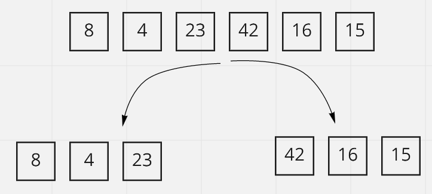
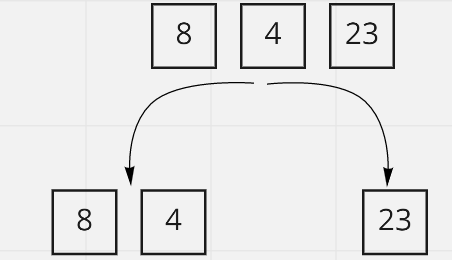
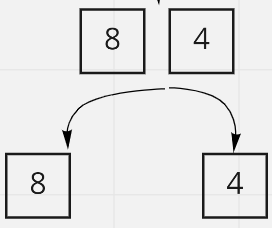
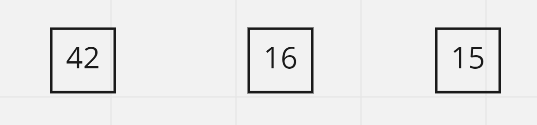
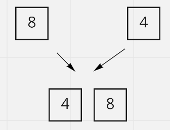
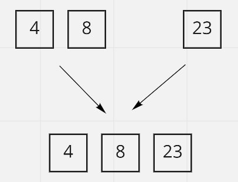

# Tracing Merge Sort Code
This article traces a psuedo code for merge sort, here an array will be devided into smaller sub-arrays and these sub-arrays will be merged after sorting

## Pseudo Code
    ALGORITHM Mergesort(arr)
    DECLARE n <-- arr.length

    if n > 1
      DECLARE mid <-- n/2
      DECLARE left <-- arr[0...mid]
      DECLARE right <-- arr[mid...n]
      // sort the left side
      Mergesort(left)
      // sort the right side
      Mergesort(right)
      // merge the sorted left and right sides together
      Merge(left, right, arr)

    ALGORITHM Merge(left, right, arr)
    DECLARE i <-- 0
    DECLARE j <-- 0
    DECLARE k <-- 0

    while i < left.length && j < right.length
        if left[i] <= right[j]
            arr[k] <-- left[i]
            i <-- i + 1
        else
            arr[k] <-- right[j]
            j <-- j + 1

        k <-- k + 1

    if i = left.length
       set remaining entries in arr to remaining values in right
    else
       set remaining entries in arr to remaining values in left

## Tracing

Input: [8,4,23,42,16,15]

### First, Splitting:

1. The array is devided into two arrays:

    Left: [8,4,23]

    Right: [42,16,15]

  

2. The merge sort function is called for the left array now, splitting it into two arrays

     Left: [8,4]

    Right: [23]

  

3. The merge sort function is called for the left array again, splitting it into two arrays

     Left: [8]

    Right: [4]

  

  Now the array length is 1, so no more calling for the mege sort function happens, the same happens to the right array which results in:

  

### Second, Sort and Merge:
1. The 4 is compared to 8, 4 being the smallest it is set as first in the input array

    

2. Now [4,8] and [23] will enter the merge function:

    i=0   j=0:

    left[0]= 4 < right [0]= 23

    arr[0]=4

    i=1   j=0:

    left[1]= 8 < right [0]= 23

    arr[1]=8

    because i = 2, the rest of arr will be completed from the right array, the array becomes:

      

  3. The same goes with the right side to become [15,16,42], now the two arrays are sorted and combined to have:

      [4,8,15,16,23,42]

