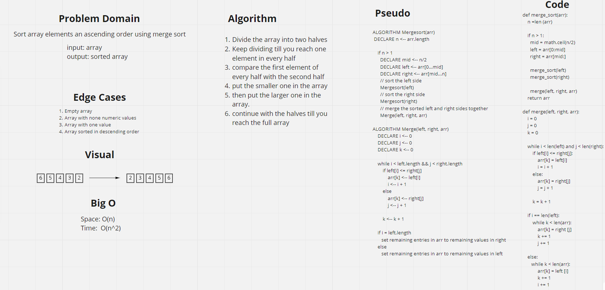

# Challenge Summary
Sort array elements an ascending order using merge sort

## Whiteboard Process

## Approach & Efficiency
A while loop was used inside a recursive function, resulted in a big o of N^2 for time, and a bigo of n for space
