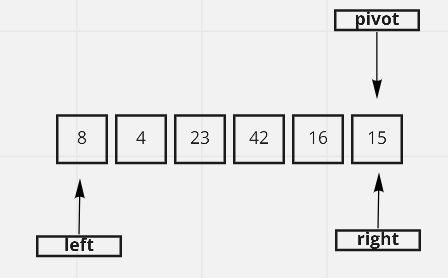
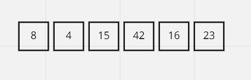
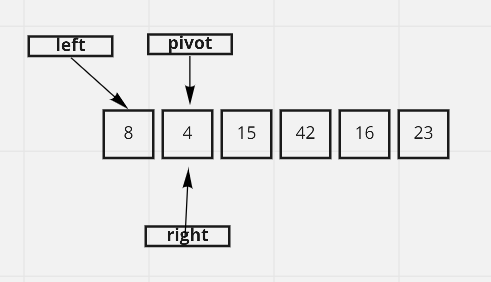
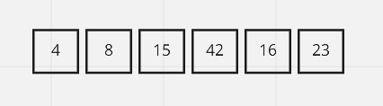
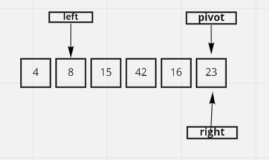
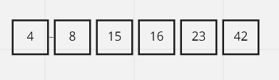

# Tracing Quick Sort Code
This article traces a psuedo code for quick sort

## Pseudo Code
    ALGORITHM QuickSort(arr, left, right)
    if left < right
        // Partition the array by setting the position of the pivot value
        DEFINE position <-- Partition(arr, left, right)
        // Sort the left
        QuickSort(arr, left, position - 1)
        // Sort the right
        QuickSort(arr, position + 1, right)

    ALGORITHM Partition(arr, left, right)
    // set a pivot value as a point of reference
    DEFINE pivot <-- arr[right]
    // create a variable to track the largest index of numbers lower than the defined pivot
    DEFINE low <-- left - 1
    for i <- left to right do
        if arr[i] <= pivot
            low++
            Swap(arr, i, low)

     // place the value of the pivot location in the middle.
     // all numbers smaller than the pivot are on the left, larger on the right.
     Swap(arr, right, low + 1)
    // return the pivot index point
     return low + 1

    ALGORITHM Swap(arr, i, low)
    DEFINE temp;
    temp <-- arr[i]
    arr[i] <-- arr[low]
    arr[low] <-- temp

## Tracing
[8,4,23,42,16,15]

1. The QuickSort will call the Partition function:

    left =0, right =5

    pivot = 15

        low = 1

        for 0 to 5

            i = 0:
            temp= 8
            [8,4,23,42,16,15]

            i = 1:
            temp= 8
            [8,4,23,42,16,15]

            i = 2:
            nothing

            i = 3:
            nothing

            i = 4:
            nothing

        Swap(arr,5, 2)

            [8,4,15,42,16,23]

        

        The Partition function retunrn 2 as position

2. Now the function will call QuickSort(arr, 0, 1)

        [8,4,15,42,16,23]

        pivot = 4

        low = -1
        for 0 to 1

        i=0:
        Swap(arr, 1, 0)
            [4,8,15,42,16,23]

        The Partition function retunrn 0 as position

3. Now the function will call QuickSort(arr, 0, -1) which does nothing

4. Now the function will call QuickSort(arr, 1, 5)

    [4,8,15,42,16,23]

    pivot = 23

        low = 3
        for 1 to 5

        i= 1:
        i= 2:
        i= 3: 
        i= 4: 
        Swap(arr, 4, 3)
        [4,8,15,16,42,23]

        Swap(arr, 5, 4)
        [4,8,15,16,23,42]

The array is sorted now, any further calls will do nothing until no calls are done
