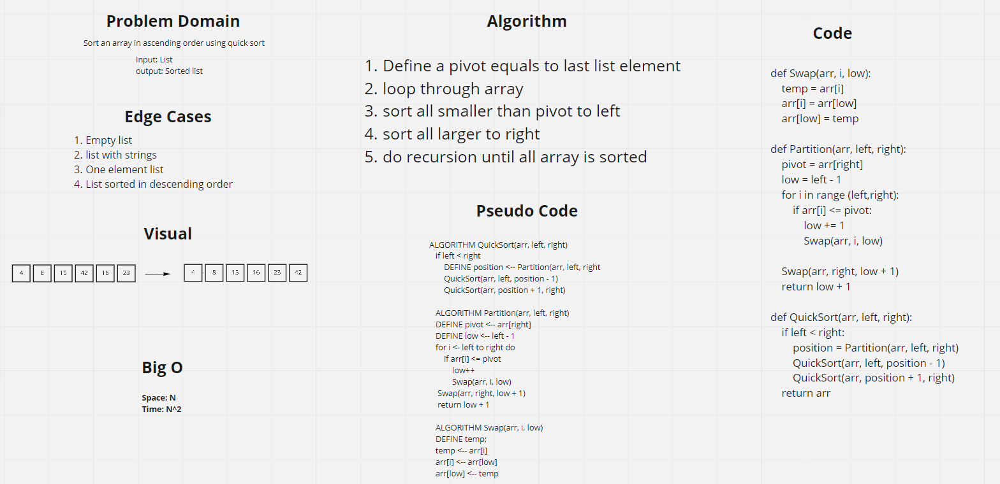

# Challenge Summary
Sort an array in ascending order using quick sort

## Whiteboard Process

## Approach & Efficiency
Space: O(n) A number of spaces created in stack equal to the list length in worst cse scenario

Time: O(n^2) because of having a loop inside recursion call
