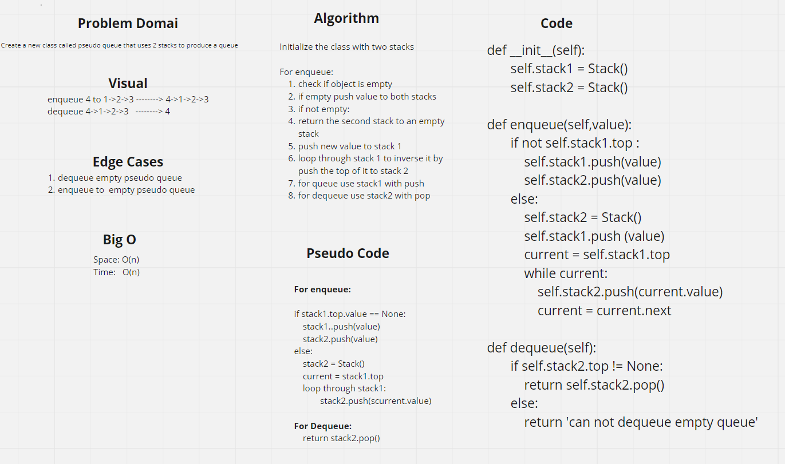

# Stacks and Queues
A stack is a data structure consists of a collection of nodes in which each node refrences the next node, adding (pushing) and removing (popping) from a stack means to add and remove to the top of the stack.

A queue is also a collection of nodes where each node refrences the next node, adding (enqueue) and removing (dequeue) means to add the rear (last added node) and removing from the front (first added node)

*see this [Code Fellows link](https://codefellows.github.io/common_curriculum/data_structures_and_algorithms/Code_401/class-10/resources/stacks_and_queues.html) for more information*

## Challenge
Create classes for stacks and queues, add methods to add and remove; return peek (front for queue and top for stack), and check if eighther is empty.

## Approach & Efficiency
O(1) for all methods, they all check one node, reassign it, or remove it.

## API
N/A

# Challenge Summary
Create a new class called pseudo queue that uses 2 stacks to produce a queue

## Whiteboard Process
[challenge11 whiteboard](https://webwhiteboard.com/board/LxE55TurXZVLvPwZDHUM79WS8uH5NR2r/)

## Approach & Efficiency
I needed to reach every stack element, so I used loops, this resulted in a big O of n

## Solution
Tests are provided
