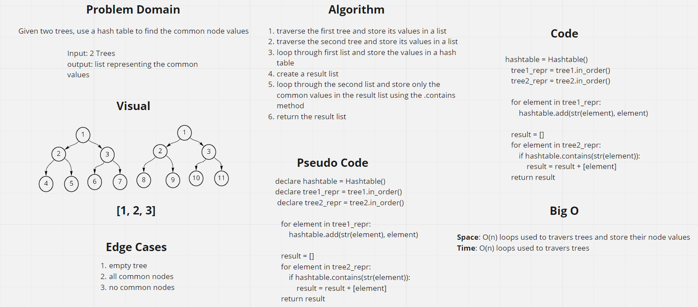

# Challenge Summary
Given two trees, use a hash table to find the common node values

## Whiteboard Process

## Approach & Efficiency
Space: O(n) loops used to travers trees and store their node values
Time: O(n) loops used to travers trees

## Solution
The function takes two trees as arguments and returns the common values, see image for example
