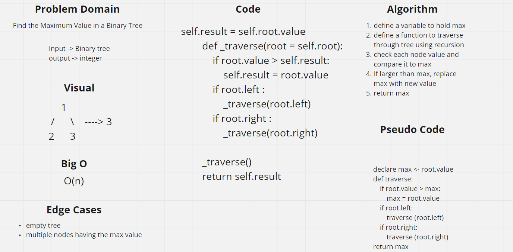
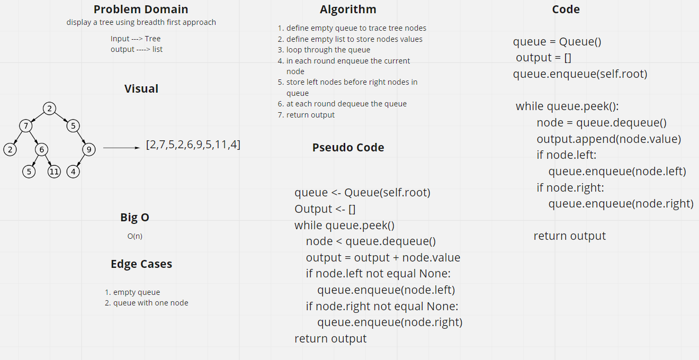

# Trees
Tree is a type of data structure consists of nodes in which every node can refrence more than one node, the node with no nodes refrencing it is called the root, a node can only be refrenced from one node in the tree i.e. it is not allowed to have two nodes refrencing (pointing to) the same node.

*see [Code Fellows](https://codefellows.github.io/common_curriculum/data_structures_and_algorithms/Code_401/class-15/resources/Trees.html)*

## Challenge
Create a class to create binary trees (a tree with a max of two nodes for each node to refrence), define functions to display the pre, in , and post order represntation of the tree.

Also, the challenge requires the creation of a subclass for the binary tree class called binary search tree, here the value is stored to the right of the root node if it is higher than the root node value or on the left if lower. Methods for adding nodes and searching for values need to be defined.

## Approach & Efficiency
Loops (without nesting) and recursions were used to traverse trees, resulting in a Big O of n

# Challenge 16 Summary
Find max of a tree

## Whiteboard Process

## Approach & Efficiency
Recursion used resulted in a big o of n

# Challenge 17 Summary
Dispaly a queue using breadth first approach

## Whiteboard Process

## Approach & Efficiency
A loop was used to traverse and store values resulted in a big o of n

